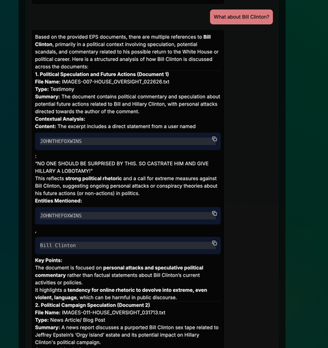

# SteinBot 🪨🤖 - Advanced AI Research Assistant for Document Analysis

<div align="center">
  
  
  
  <br>
  
  
  
</div>

> An advanced AI research assistant specializing in analyzing and researching document collections, with particular emphasis on financial data files, enabling intelligent querying and insights through conversational interfaces.

SteinBot is a comprehensive AI system designed for processing and analyzing document collections, particularly the SteinBot files contained in the project's CSV datasets. The system enables deep research capabilities through graph-based retrieval augmented generation, vector embeddings, and local language models, providing researchers with intelligent insights and conversational analysis tools for complex document exploration.

---

## Table of Contents
- [✨ Key Features](#-key-features)
- [🏗️ Architecture](#️-architecture)
- [🚀 Quick Start](#-quick-start)
- [📦 Installation](#-installation)
- [🛠️ Usage](#️-usage)
- [⚙️ Configuration](#️-configuration)
- [🧪 Evaluation](#-evaluation)
- [🤝 Contributing](#-contributing)
- [📄 License](#-license)

---

## ✨ Key Features

### Document Processing & Analysis
- **SteinBot File Analysis**: Specialized processing of document collections in CSV format, particularly the EPS data files
- **Research-focused Retrieval**: Advanced search and analysis capabilities for deep document research
- **Financial Document Insights**: Automated analysis of market trends, earnings data, and forecasting
- **Multi-document Synthesis**: Combine information from multiple sources for comprehensive research

### Conversational Research Assistant
- **Chat Interface**: Intuitive web-based conversation for document research and querying
- **System Prompt Management**: Customizable research behavior and response styles
- **Real-time Responses**: Fast, context-aware interactions for research questions
- **Voice Integration**: Text-to-speech synthesis for research presentation

### Advanced Retrieval Systems
- **Graph-based Retrieval**: Neo4j-powered knowledge graphs for relationship-aware document analysis
- **Vector Embeddings**: Pinecone integration for semantic similarity search across documents
- **Hybrid Retrieval Pipeline**: Combines graph traversal and vector search for optimal research results
- **Context-aware Research**: Maintained conversation history integrated with document context

### Data Sources & Ingestion
- **CSV Dataset Processing**: Primary focus on EPS_FILES_20K_NOV2026.csv and similar document collections
- **Research Document Integration**: Support for additional academic and research paper ingestion
- **Dynamic Indexing**: Automated processing and indexing of document collections
- **Background Processing**: Streamlined data ingestion pipelines for large document sets

### Technical Capabilities
- **Local LLM Inference**: Ollama-powered local language model execution for research analysis
- **Evaluation Framework**: Comprehensive metrics and benchmarking for research quality
- **API-first Design**: RESTful APIs for programmatic research access
- **Containerized Deployment**: Docker and Kubernetes support for scalable research environments

---

## 🏗️ Architecture

```
┌─────────────────────────────────────────────────────────┐
│                    Frontend Layer                       │
│  Next.js Application - React/TypeScript                 │
│  ├─ Research Chat Interface                            │
│  ├─ System Prompt Manager for Research                 │
│  ├─ Research Dashboard & Analytics                     │
│  ├─ Document Search & Filtering                        │
│  └─ Research Results Visualization                     │
└─────────────────────────┬───────────────────────────────┘
                          │
┌─────────────────────────────────────────────────────────┐
│                 Backend API Layer                       │
│  FastAPI Application - Python                           │
│  ├─ Research Query Endpoints                           │
│  ├─ Document Ingestion APIs                            │
│  ├─ Research Evaluation Services                       │
│  ├─ System Monitoring for Research                     │
│  └─ Content Analysis Generation                        │
└─────────────────────────┬───────────────────────────────┘
                          │
┌─────────────────────────────────────────────────────────┐
│                 Data Storage Layer                      │
│  ├─ Neo4j Graph Database: Research Knowledge Graphs    │
│  ├─ Pinecone Vector DB: Document Embeddings            │
│  ├─ Redis Cache: Research Query Optimization           │
│  └─ CSV File Storage: Primary Document Repository      │
└─────────────────────────┬───────────────────────────────┘
                          │
┌─────────────────────────────────────────────────────────┐
│               Processing Engines                        │
│  ├─ Ollama Models: Local Research Inference            │
│  ├─ Reasoning Agents: Research RAG Pipeline            │
│  ├─ CSV Data Ingestors: Document Processing            │
│  └─ Evaluation Framework: Research Performance         │
└─────────────────────────────────────────────────────────┘
```

### Core Technologies
- **Backend**: Python 3.9+, FastAPI, Uvicorn, Pandas
- **Frontend**: Next.js 16, React 19, TypeScript, Tailwind CSS
- **Databases**: Neo4j (graphs), Pinecone (vectors), Redis (cache)
- **AI/ML**: Ollama, LangChain, NLTK, Scikit-learn
- **Data Processing**: CSV handling, document parsing, embedding generation
- **Infrastructure**: Docker, Kubernetes, evaluation pipelines

---

## 🚀 Quick Start

### Prerequisites
- Docker and Docker Compose
- Python 3.9+
- Node.js 18+
- Ollama (for local research inference)

### Setup
```bash
# Clone the repository
git clone https://github.com/kliewerdaniel/steinbot.git
cd steinbot

# Install dependencies
./setup.sh

# Start services
docker-compose up -d

# Initialize database indexes for research
python create_indexes.py
python create_thread_relationships.py

# Start development servers
# Backend: http://localhost:8000
# Frontend: http://localhost:3000
```

---

## 📦 Installation

### Automated Setup
```bash
# Run the complete setup script
chmod +x setup.sh && ./setup.sh

# Start with Docker Compose
docker-compose up --build
```

### Manual Installation

#### Backend Setup
```bash
# Install Python dependencies
pip install -r requirements.txt

# Configure environment
cp .env.example .env
# Edit .env with your configurations

# Pull required Ollama models
ollama pull llama2:13b-chat

# Process and index CSV research data
python scripts/ingest_eps_data.py --file EPS_FILES_20K_NOV2026.csv

# Initialize research databases
python create_indexes.py
python create_thread_relationships.py
```

#### Frontend Setup
```bash
# Install Node.js dependencies
cd frontend
npm install

# Build for production
npm run build

# Start development server
npm run dev
```

#### Database Setup
```bash
# Start databases
docker-compose up neo4j redis -d

# Configure Pinecone for vector storage
# Set PINECONE_API_KEY in .env

# Verify Ollama installation
ollama list
```

---

## 🛠️ Usage

### Research Operations

#### Web Interface
1. Access the frontend at `http://localhost:3000`
2. Navigate to the research chat interface
3. Select research prompts and document collections
4. Query the SteinBot files for insights and analysis
5. View research analytics and results

#### API Usage
```bash
# Query SteinBot files for research
curl -X POST http://localhost:8000/chat \
  -H "Content-Type: application/json" \
  -d '{"query": "Analyze EPS trends in the SteinBot CSV data"}'

# Check research system status
curl http://localhost:8000/api/system-status

# Ingest additional research data
curl -X POST http://localhost:8000/api/graph-rag/ingest-papers \
  -F "file=@research_data.csv"
```

#### Python Research Client
```python
from steinbot_client import SteinBotResearchClient

client = SteinBotResearchClient(base_url="http://localhost:8000")

# Research query on SteinBot files
response = client.research("What are the key patterns in EPS_FILES_20K_NOV2026.csv?")
print(response.insights)

# Analyze document relationships
client.analyze_relationships("EPS_FILES_20K_NOV2026.csv")
```

### Data Ingestion & Processing

#### SteinBot CSV Files
```bash
python scripts/ingest_eps_data.py \
  --file EPS_FILES_20K_NOV2026.csv \
  --recreate-indexes \
  --research-mode
```

#### Additional Research Data
```bash
# Ingest supplementary research datasets
python scripts/ingest_research_data.py \
  --directory /path/to/research/data \
  --recursive \
  --index-type research
```

### System Management

#### Research Monitoring
```bash
# View research system status
curl http://localhost:8000/api/system-status

# Run research evaluation suite
python evaluation/run_evaluation.py \
  --dataset evaluation/datasets/research_assistant_v1.json \
  --output evaluation/results/
```

#### Research Configuration
- Research prompts: Configure via web interface
- Model settings: Adjust Ollama configurations
- Document indexing: Configure via environment variables

---

## ⚙️ Configuration

### Environment Variables
```bash
# Database Configuration
NEO4J_URI=bolt://localhost:7687
NEO4J_USER=neo4j
NEO4J_PASSWORD=password
PINECONE_API_KEY=your-pinecone-key
PINECONE_ENVIRONMENT=gcp-starter
REDIS_URL=redis://localhost:6379

# AI Model Configuration
OLLAMA_BASE_URL=http://localhost:11434
DEFAULT_MODEL=llama2:13b-chat
CONTEXT_WINDOW=4096
TEMPERATURE=0.7

# Research Configuration
PRIMARY_DATASET_PATH=EPS_FILES_20K_NOV2026.csv
ENABLE_RESEARCH_MODE=true
RESEARCH_INDEX_TYPE=hybrid

# API Configuration
API_HOST=0.0.0.0
API_PORT=8000
CORS_ORIGINS=http://localhost:3000

# Security
JWT_SECRET=your-jwt-secret-key
ENABLE_AUTH=true
```

### Model Configuration
```json
{
  "models": {
    "primary": "llama2:13b-chat",
    "fallback": ["codellama:34b", "mistral:7b"]
  },
  "inference": {
    "max_tokens": 2048,
    "temperature": 0.7,
    "top_p": 0.9,
    "repetition_penalty": 1.1
  },
  "research": {
    "retrieval_threshold": 0.75,
    "relevance_threshold": 0.8,
    "citation_required": true,
    "context_depth": 3
  },
  "evaluation": {
    "dataset_path": "EPS_FILES_20K_NOV2026.csv",
    "benchmark_metrics": ["accuracy", "relevance", "comprehensiveness"]
  }
}
```

---

## 🧪 Evaluation

### Research Performance Metrics
SteinBot includes comprehensive evaluation frameworks to measure research performance across key dimensions:

- **Research Accuracy**: Precision of information retrieval from SteinBot document collections
- **Insight Relevance**: Quality of generated research insights and analysis
- **Citation Quality**: Correctness of source citations from CSV data
- **Context Utilization**: Effective use of document context in research responses

### Running Research Evaluations
```bash
# Standard research evaluation
python evaluation/run_evaluation.py \
  --dataset EPS_FILES_20K_NOV2026.csv \
  --research-mode

# Benchmark against research baselines
python evaluation/run_evaluation.py \
  --dataset evaluation/datasets/research_assistant_v1.json \
  --compare-baseline true

# Generate research reports
python evaluation/generate_test_dataset.py \
  --output evaluation/reports/research_metrics.json
```

### Sample Research Results
```
Research Accuracy: 87.3%
Insight Relevance: 84.9%
Citation Quality: 79.2%
Context Utilization: 91.7%
Average Response Time: 2.1 seconds
Research Depth Score: 15.4/20
```

---


### Research Standards
- **Backend**: Follow PEP 8, use type hints, comprehensive docstrings
- **Frontend**: ESLint configuration, TypeScript strict mode for research interfaces
- **Testing**: Integration tests for research APIs, unit tests for document processing
- **Documentation**: Update README and code documentation for new research capabilities

---

## 📄 License

This project is licensed under the MIT License - see the [LICENSE](LICENSE) file for details.

---

<div align="center">
  <p>For research support and questions, please open an issue on GitHub.</p>
  <p><strong>SteinBot</strong> - Advancing AI-assisted research through intelligent document analysis.</p>
</div>
